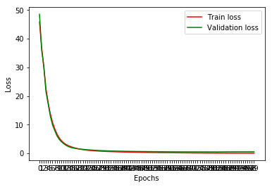
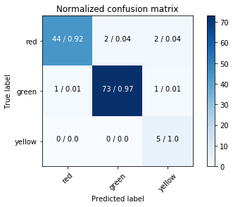

In this notebook, we'll create a framework for image classification in Tensorflow.

This code should be replicable to any image task with a few changes.

Our specific task will be to classify images of traffic lights as red, yellow, or green.


```python
import sys
import os
import time
import itertools
import math
import random
import glob
import tensorflow as tf
import numpy as np
import cv2
from sklearn.metrics import confusion_matrix
from sklearn.model_selection import train_test_split
import matplotlib.pyplot as plt
from IPython.display import Image, display
import warnings
warnings.filterwarnings('ignore')

%matplotlib inline
```

First, we set some basic parameters:

    base_image_path: the path where our training data is stored
    
    image_types: subdirectories in the images folder, each one representing a different class
    
    input_img_x/y: width and height of the images
    
    train_test_split_ratio: the ratio of training images to testing images
    
    batch_size: the minibatch size
    
    checkpoint_name: where we will save our best model
    


```python
# Basic parameters

base_image_path = "traffic_light_images/"
image_types = ["red", "green", "yellow"]
input_img_x = 32
input_img_y = 32
train_test_split_ratio = 0.9
learning_rate = 0.0001
max_epochs = 100
batch_size = 128
checkpoint_name = "model"
print('Basic parameters initialized')
```

    Basic parameters initialized


We need to load in our images.  We do so using OpenCV's imread function.  After loading in each image, we resize it to our input size.

With each loaded image, we also specify the expected output.  For this, we use a one-hot encoding, creating an array of zeros represnting each class, and setting the index of the expected class number to 1.

For example, if we have three classes, and we expect an order of: [red neuron, green neuron, yellow neuron]

We initialize an array to [0, 0, 0] and if we loaded a yellow light, we change the last value to 1: [0, 0, 1]

Finally, we shuffle our dataset.  (It's generally useful to seed our random generator with 0 at the start of the program)


```python
time_start = time.time()

v_loss = least_loss = 99999999

# Load data

full_set = []

for im_type in image_types:
    for ex in glob.glob(os.path.join(base_image_path, im_type, "*")):
        im = cv2.imread(ex)
        if not im is None:
            im = cv2.resize(im, (32, 32))

            # Create an array representing our classes and set it
            one_hot_y = [0] * len(image_types)
            one_hot_y[image_types.index(im_type)] = 1
            assert(im.shape == (32, 32, 3))

            full_set.append((im, one_hot_y, ex))

random.shuffle(full_set)
print(len(full_set))

```

    1484


Using our train_test_split_ratio we create two lists of examples: testing and training.


```python
# We split our data into a training and test set here

split_index = int(math.floor(len(full_set) * train_test_split_ratio))
train_set = full_set[:split_index]
test_set = full_set[split_index:]

# We ensure that our training and test sets are a multiple of batch size
train_set_offset = len(train_set) % batch_size
test_set_offset = len(test_set) % batch_size
train_set = train_set[: len(train_set) - train_set_offset]
test_set = test_set[: len(test_set) - test_set_offset]

X_train, y_train, train_z = zip(*train_set)
X_test, y_test, test_z = zip(*test_set)

X_train, X_valid, y_train, y_valid = train_test_split(X_train, y_train, 
                                                            test_size=0.20, random_state=42)

print(len(X_train))
print(len(X_valid))
print(len(X_test))
```

    1024
    256
    128


```python
# Helper layer functions
def weight_variable(shape):
    initial = tf.truncated_normal(shape, stddev=0.1)
    return tf.Variable(initial)

def bias_variable(shape):
    initial = tf.constant(0.1, shape=shape)
    return tf.Variable(initial)

def conv2d(x, W, stride):
    return tf.nn.conv2d(x, W, strides=[1, stride, stride, 1], padding='SAME')

def max_pool_2x2(x):
    return tf.nn.max_pool(x, ksize=[1, 2, 2, 1],
                        strides=[1, 2, 2, 1], padding='SAME')
print('done')
```

    done


Here we initialize our input and output neurons.

Our input neurons will be the shape of the image which is (32 x 32 x 3)

Because our data will be one-hot encoded, we have as many output neurons as we have classes


```python
# Model

x = tf.placeholder(tf.float32, shape=[None, input_img_x, input_img_y, 3])
y_ = tf.placeholder(tf.float32, shape=[None, len(image_types)])
keep_prob = tf.placeholder(tf.float32) # probability to keep units
```

This is where we specify our first convolutional layers.

We specify the number of weights in the first line:

    W_conv1 = weight_variable([3, 3, 3, 16])
    
This line is for specifying the number of bias variables, or the variables that will be added to weights after multiplying them by the activation.

    b_conv1 = bias_variable([16])
    
Next, we specify the activation:

    h_conv1 = tf.nn.relu(conv2d(x_image, W_conv1, 1) + b_conv1)


```python
x_image = x

# Our first three convolutional layers, of 16 3x3 filters
W_conv1 = weight_variable([3, 3, 3, 16])
b_conv1 = bias_variable([16])
h_conv1 = tf.nn.relu(tf.nn.bias_add(conv2d(x_image, W_conv1, 1), b_conv1))

W_conv2 = weight_variable([3, 3, 16, 16])
b_conv2 = bias_variable([16])
h_conv2 = tf.nn.relu(tf.nn.bias_add(conv2d(h_conv1, W_conv2, 1), b_conv2))

W_conv3 = weight_variable([3, 3, 16, 16])
b_conv3 = bias_variable([16])
h_conv3 = tf.nn.relu(tf.nn.bias_add(conv2d(h_conv2, W_conv3, 1), b_conv3))

# Our pooling layer
h_pool4 = max_pool_2x2(h_conv3)
n1, n2, n3, n4 = h_pool4.get_shape().as_list()

# We flatten our pool layer into a fully connected layer
h_pool4_flat = tf.reshape(h_pool4, [-1, n2*n3*n4])

W_fc1 = weight_variable([n2*n3*n4, 3])
b_fc1 = bias_variable([3])
logits = tf.nn.bias_add(tf.matmul(h_pool4_flat, W_fc1), b_fc1)
print('done')
```

    done


Our loss function is defined as computing softmax, and then cross entropy.

We also specify our optimizer, which takes a learning rate, and a loss function.

Finally, we initialize all of our variables which will tell us if our model is valid.


```python
# Our loss function and optimizer

loss = tf.reduce_mean(tf.nn.softmax_cross_entropy_with_logits(labels = y_, logits = logits))
train_step = tf.train.AdamOptimizer(learning_rate=learning_rate).minimize(loss)

```

    WARNING:tensorflow:From <ipython-input-8-4beac842dd51>:3: softmax_cross_entropy_with_logits (from tensorflow.python.ops.nn_ops) is deprecated and will be removed in a future version.
    Instructions for updating:
    
    Future major versions of TensorFlow will allow gradients to flow
    into the labels input on backprop by default.
    
    See @{tf.nn.softmax_cross_entropy_with_logits_v2}.
    


Every time we iterate over all of our training examples, we have completed one epoch.  Generally, we should start with one epoch while debugging, and in practice many datasets will converge with less than 100 epochs.  It's something that needs to be explored with each dataset.

We split our training set into batches, which we train on in order.

We then use our entire datset to calculate training and validation loss.  These are the values we want to minimize, but it's important to pay attention to the interaction between them.  If training loss is going down, but validation is staying the same, it means we are overfitting our dataset: our network is becoming increasingly good at correctly classifying our training examples, but our network isn't generalizing to other examples outside the training set.

We save our model if the current model has the lowest validation seen in this training run.


```python
sess = tf.InteractiveSession()
saver = tf.train.Saver()
sess.run(tf.global_variables_initializer())
v_loss = 9999999
train_loss = []
val_loss = []

print("Starting training... [{} training examples]".format(len(X_train)))

for i in range(0, max_epochs):

    # Iterate over our training set
    for batch_i in range(0, int((len(X_train) / batch_size))):
        start_batch = batch_size * batch_i
        end_batch = batch_size * (batch_i + 1)
        train_step.run(feed_dict={x: X_train[start_batch:end_batch], y_: y_train[start_batch:end_batch]})
        ex_seen = "Current epoch{:5} examples seen: {:20} / {} \r".format(i+1, batch_i * batch_size, len(X_train))
        sys.stdout.write(ex_seen.format(batch_i * batch_size))
        sys.stdout.flush()

    ex_seen = "Current epoch{:5} examples seen: {:20} / {} \r".format(i+1, (batch_i + 1) * batch_size, len(X_train))
    sys.stdout.write(ex_seen.format(batch_i * batch_size))
    sys.stdout.flush()

    t_loss = loss.eval(feed_dict={x: X_train, y_: y_train})
    v_loss = loss.eval(feed_dict={x: X_valid, y_: y_valid})
    ,
    train_loss.append(t_loss)
    val_loss.append(v_loss)

    sys.stdout.write("Epoch {:5}: loss: {:15.10f}, val.loss: {:15.10f}".format(i + 1, t_loss, v_loss))

    if v_loss < least_loss:
        sys.stdout.write(", saving new best model to {}".format(checkpoint_name))
        least_loss = v_loss
        filename = saver.save(sess, "deepcars/model")

    sys.stdout.write("\n")

plt.figure()
plt.xticks(np.arange(0, len(train_loss), 1.0))
plt.ylabel("Loss")
plt.xlabel("Epochs")
train_line = plt.plot(range(0, len(train_loss)), train_loss, 'r', label="Train loss")
val_line = plt.plot(range(0, len(val_loss)), val_loss, 'g', label="Validation loss")
plt.legend()
plt.show()
```

    Starting training... [1024 training examples]
    Epoch     1: loss:   45.8199310303, val.loss:   48.5383224487, saving new best model to model
    Epoch     2: loss:   36.9157981873, val.loss:   36.0543518066, saving new best model to model
    Epoch     3: loss:   29.9068717957, val.loss:   30.4468669891, saving new best model to model
    Epoch     4: loss:   22.4238300323, val.loss:   21.4654808044, saving new best model to model
    Epoch     5: loss:   17.6990509033, val.loss:   17.2492523193, saving new best model to model
    Epoch     6: loss:   13.7940111160, val.loss:   13.0003271103, saving new best model to model
    Epoch     7: loss:   10.8401107788, val.loss:    9.9628143311, saving new best model to model
    Epoch     8: loss:    8.6153783798, val.loss:    8.0143299103, saving new best model to model
    Epoch     9: loss:    6.8305730820, val.loss:    6.2092900276, saving new best model to model
    Epoch    10: loss:    5.4917125702, val.loss:    4.9666175842, saving new best model to model
    Epoch    11: loss:    4.4819478989, val.loss:    4.1125507355, saving new best model to model
    Epoch    12: loss:    3.7470116615, val.loss:    3.4579098225, saving new best model to model
    Epoch    13: loss:    3.1988720894, val.loss:    2.8802013397, saving new best model to model
    Epoch    14: loss:    2.7782123089, val.loss:    2.4604291916, saving new best model to model
    Epoch    15: loss:    2.4427633286, val.loss:    2.1312861443, saving new best model to model
    Epoch    16: loss:    2.1571230888, val.loss:    1.9021041393, saving new best model to model
    Epoch    17: loss:    1.9275380373, val.loss:    1.7683767080, saving new best model to model
    Epoch    18: loss:    1.7255908251, val.loss:    1.6308864355, saving new best model to model
    Epoch    19: loss:    1.5541998148, val.loss:    1.5295381546, saving new best model to model
    Epoch    20: loss:    1.4112282991, val.loss:    1.4555931091, saving new best model to model
    Epoch    21: loss:    1.2757220268, val.loss:    1.3657324314, saving new best model to model
    Epoch    22: loss:    1.1664011478, val.loss:    1.3079702854, saving new best model to model
    Epoch    23: loss:    1.0759444237, val.loss:    1.2449389696, saving new best model to model
    Epoch    24: loss:    0.9985511899, val.loss:    1.1788554192, saving new best model to model
    Epoch    25: loss:    0.9348859191, val.loss:    1.1258932352, saving new best model to model
    Epoch    26: loss:    0.8763502240, val.loss:    1.0772733688, saving new best model to model
    Epoch    27: loss:    0.8247500658, val.loss:    1.0305694342, saving new best model to model
    Epoch    28: loss:    0.7808452845, val.loss:    0.9915640950, saving new best model to model
    Epoch    29: loss:    0.7406659126, val.loss:    0.9527915716, saving new best model to model
    Epoch    30: loss:    0.7038031816, val.loss:    0.9175297022, saving new best model to model
    Epoch    31: loss:    0.6714834571, val.loss:    0.8887194395, saving new best model to model
    Epoch    32: loss:    0.6397066116, val.loss:    0.8579742312, saving new best model to model
    Epoch    33: loss:    0.6109222174, val.loss:    0.8351455927, saving new best model to model
    Epoch    34: loss:    0.5826843977, val.loss:    0.8112949729, saving new best model to model
    Epoch    35: loss:    0.5560786724, val.loss:    0.7914248109, saving new best model to model
    Epoch    36: loss:    0.5307468176, val.loss:    0.7734306455, saving new best model to model
    Epoch    37: loss:    0.5060716867, val.loss:    0.7552825212, saving new best model to model
    Epoch    38: loss:    0.4827677310, val.loss:    0.7378789186, saving new best model to model
    Epoch    39: loss:    0.4609362483, val.loss:    0.7205114961, saving new best model to model
    Epoch    40: loss:    0.4406011105, val.loss:    0.7032504678, saving new best model to model
    Epoch    41: loss:    0.4224001765, val.loss:    0.6877372265, saving new best model to model
    Epoch    42: loss:    0.4059522748, val.loss:    0.6731293201, saving new best model to model
    Epoch    43: loss:    0.3905458450, val.loss:    0.6595671177, saving new best model to model
    Epoch    44: loss:    0.3762713075, val.loss:    0.6473047733, saving new best model to model
    Epoch    45: loss:    0.3627431691, val.loss:    0.6378474832, saving new best model to model
    Epoch    46: loss:    0.3496894240, val.loss:    0.6284431815, saving new best model to model
    Epoch    47: loss:    0.3370112479, val.loss:    0.6197186112, saving new best model to model
    Epoch    48: loss:    0.3246169090, val.loss:    0.6130234003, saving new best model to model
    Epoch    49: loss:    0.3124757409, val.loss:    0.6059786677, saving new best model to model
    Epoch    50: loss:    0.3004961014, val.loss:    0.5980920792, saving new best model to model
    Epoch    51: loss:    0.2885210514, val.loss:    0.5906119347, saving new best model to model
    Epoch    52: loss:    0.2766079307, val.loss:    0.5829771757, saving new best model to model
    Epoch    53: loss:    0.2647090554, val.loss:    0.5769916773, saving new best model to model
    Epoch    54: loss:    0.2532064021, val.loss:    0.5711771250, saving new best model to model
    Epoch    55: loss:    0.2426895797, val.loss:    0.5661495924, saving new best model to model
    Epoch    56: loss:    0.2331624627, val.loss:    0.5597942472, saving new best model to model
    Epoch    57: loss:    0.2246347815, val.loss:    0.5542560816, saving new best model to model
    Epoch    58: loss:    0.2162143290, val.loss:    0.5472901464, saving new best model to model
    Epoch    59: loss:    0.2083834708, val.loss:    0.5417858362, saving new best model to model
    Epoch    60: loss:    0.2002344728, val.loss:    0.5348567963, saving new best model to model
    Epoch    61: loss:    0.1926617324, val.loss:    0.5303308964, saving new best model to model
    Epoch    62: loss:    0.1849667579, val.loss:    0.5249408484, saving new best model to model
    Epoch    63: loss:    0.1774286926, val.loss:    0.5199604034, saving new best model to model
    Epoch    64: loss:    0.1698803008, val.loss:    0.5138998032, saving new best model to model
    Epoch    65: loss:    0.1620712131, val.loss:    0.5105580091, saving new best model to model
    Epoch    66: loss:    0.1544777602, val.loss:    0.5074986815, saving new best model to model
    Epoch    67: loss:    0.1463870406, val.loss:    0.5040615797, saving new best model to model
    Epoch    68: loss:    0.1393431127, val.loss:    0.5077056289 
    Epoch    69: loss:    0.1313869953, val.loss:    0.5012488365, saving new best model to model
    Epoch    70: loss:    0.1238251105, val.loss:    0.5064363480 
    Epoch    71: loss:    0.1160012484, val.loss:    0.5028073192 
    Epoch    72: loss:    0.1086772680, val.loss:    0.5040119886 
    Epoch    73: loss:    0.1029139236, val.loss:    0.5033195019 
    Epoch    74: loss:    0.0963527709, val.loss:    0.4921954572, saving new best model to model
    Epoch    75: loss:    0.0924246907, val.loss:    0.5070766807 
    Epoch    76: loss:    0.0862152129, val.loss:    0.4851263165, saving new best model to model
    Epoch    77: loss:    0.0822685212, val.loss:    0.5093069077 
    Epoch    78: loss:    0.0759539604, val.loss:    0.4871109128 
    Epoch    79: loss:    0.0710719079, val.loss:    0.5042649508 
    Epoch    80: loss:    0.0661126301, val.loss:    0.4909642339 
    Epoch    81: loss:    0.0613505542, val.loss:    0.4900938570 
    Epoch    82: loss:    0.0604395382, val.loss:    0.5056909323 
    Epoch    83: loss:    0.0562684685, val.loss:    0.4761498570, saving new best model to model
    Epoch    84: loss:    0.0544243008, val.loss:    0.5100297928 
    Epoch    85: loss:    0.0482664108, val.loss:    0.4880601764 
    Epoch    86: loss:    0.0461587980, val.loss:    0.5150028467 
    Epoch    87: loss:    0.0416842066, val.loss:    0.5038006902 
    Epoch    88: loss:    0.0385857373, val.loss:    0.5256517529 
    Epoch    89: loss:    0.0362611413, val.loss:    0.5141050220 
    Epoch    90: loss:    0.0340083539, val.loss:    0.5287243724 
    Epoch    91: loss:    0.0327831171, val.loss:    0.5168534517 
    Epoch    92: loss:    0.0308093764, val.loss:    0.5285903215 
    Epoch    93: loss:    0.0294966772, val.loss:    0.5212414861 
    Epoch    94: loss:    0.0281446930, val.loss:    0.5318522453 
    Epoch    95: loss:    0.0272780061, val.loss:    0.5243970156 
    Epoch    96: loss:    0.0261197872, val.loss:    0.5316325426 
    Epoch    97: loss:    0.0252990089, val.loss:    0.5259259343 
    Epoch    98: loss:    0.0244238190, val.loss:    0.5329711437 
    Epoch    99: loss:    0.0235489979, val.loss:    0.5309982896 
    Epoch   100: loss:    0.0228328966, val.loss:    0.5351054072 





Let's print the examples from our test set that were wrong:


```python
zipped_x_y = zip(X_test, y_test)
conf_true = []
conf_pred = []
for i in range(0, len(X_test)):
    sfmax = list(sess.run(tf.nn.softmax(logits.eval(feed_dict={x: [X_test[i]]})))[0])
    sf_ind = sfmax.index(max(sfmax))
    
    predicted_label = image_types[sf_ind]
    actual_label = image_types[y_test[i].index(max(y_test[i]))]
    
    conf_true.append(actual_label)
    conf_pred.append(predicted_label)
    
    if predicted_label != actual_label:
        print("Actual: {}, predicted: {}".format(actual_label, predicted_label))
        img_path = test_z[i]    
        ex_img = Image(filename=img_path)
        display(ex_img)
```

    Actual: red, predicted: yellow


    Actual: green, predicted: yellow


    Actual: green, predicted: red


    Actual: red, predicted: green


    Actual: green, predicted: yellow


    Actual: green, predicted: red


```python
# From sklearn docs
def plot_confusion_matrix(cm, classes,
                          normalize=False,
                          title='Confusion matrix',
                          cmap=plt.cm.Blues):
    """
    This function prints and plots the confusion matrix.
    Normalization can be applied by setting `normalize=True`.
    """
    plt.imshow(cm, interpolation='nearest', cmap=cmap)
    plt.title(title)
    plt.colorbar()
    tick_marks = np.arange(len(classes))
    plt.xticks(tick_marks, classes, rotation=45)
    plt.yticks(tick_marks, classes)

    cm2 = cm.astype('float') / cm.sum(axis=1)[:, np.newaxis]

    cm2 = np.around(cm2, 2)

    thresh = cm.max() / 2.
    for i, j in itertools.product(range(cm.shape[0]), range(cm.shape[1])):
        plt.text(j, i, str(cm[i, j]) + " / " + str(cm2[i, j]),
                 horizontalalignment="center",
                 color="white" if cm[i, j] > thresh else "black")

    plt.tight_layout()
    plt.ylabel('True label')
    plt.xlabel('Predicted label')

cnf_matrix = confusion_matrix(conf_true, conf_pred)
plt.figure()
plot_confusion_matrix(cnf_matrix, classes=image_types, normalize=False,
                      title='Normalized confusion matrix')
plt.show()
```




